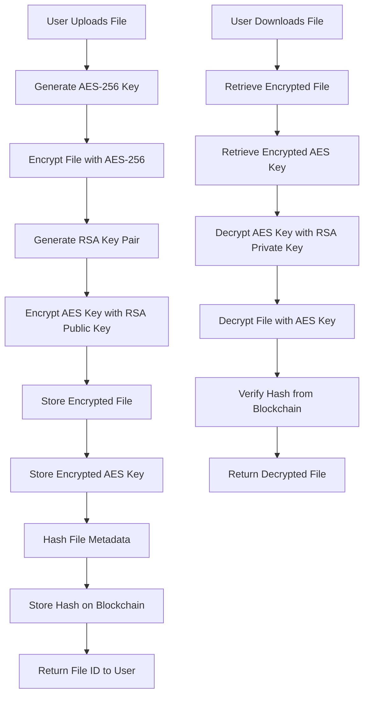

# HashVault

A secure file storage and sharing platform with blockchain integration.

## Encryption Flow



## Project Structure

```
hashvault/
├── hashvault-frontend/     # React frontend application
├── hashvault-backend/      # Node.js backend API
├── vercel.json            # Main Vercel deployment config
└── README.md              # This file
```

## Deployment

### Backend Deployment (Render)
Deploy the backend to Render:

1. Connect your GitHub repository to Render
2. Create a new Web Service
3. Set the root directory to `hashvault-backend`
4. Render will automatically detect the `render.yaml` configuration
5. Set up environment variables in Render dashboard

## Environment Variables

**Backend (Render):**
- Backend API keys
- Database connections
- Blockchain network settings